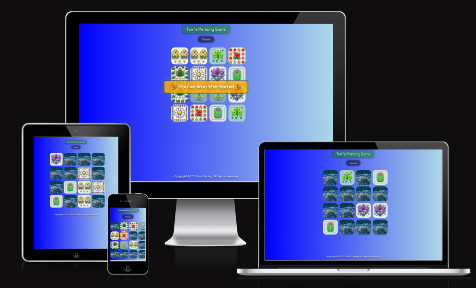

# Tom's Memory Game



[Link to Live Site](tom-memory.netlify.app)

[HTML | CSS | JS] This is a simple Memory Game where players flip cards to find matching pairs.


## Description

This is a simple Memory Game where players flip cards to find matching pairs. The game is built using HTML for structure, CSS for styling, and JavaScript for game logic and DOM manipulation.

## Features

- **Game Board**: A grid of cards that players can flip to reveal their faces.
- **Shuffle Function**: Cards are shuffled at the start of each game to ensure a unique experience every time.
- **Matching Logic**: When two cards are flipped, the game checks if they match. If they do, they remain face-up. If not, they flip back after a short delay.
- **Restart Button**: A button to reset the game board and shuffle the cards for a new game.
- **Responsive Design**: The game is designed to work well on both desktop and mobile devices.

## How to Play

1. **Start the Game**: Open the `index.html` file in your web browser.
2. **Flip Cards**: Click on any card to flip it and reveal its face.
3. **Find Matches**: Try to find two cards with the same face. If they match, they will remain face-up.
4. **Continue Playing**: Keep flipping cards until all pairs have been found.
5. **Restart**: Click the "Restart" button to shuffle the cards and start a new game.

## Setup

To set up the project locally, follow these steps:

1. **Clone the Repository**:
```bash
git clone https://github.com/tomdu3/tom-memory-game.git
```
2. **Navigate to the Project Directory**:
```bash
cd tom-memory-game
```
3. **Open the Game**:
    - Open the `index.html` file in your preferred web browser.

## File Structure

```text
memory-game/
├── assets/            # Folder for game assets
│   ├── img/           # Folder for game images
│   │   └──── memory/  # Folder for memory card images
│   ├── css/           # Folder for CSS stylesheets
|   |   └── style.css  # Main CSS file 
│   └─── js/           # Folder for JavaScript scripts
│       └── script.js  # Main JavaScript file for game logic
├── index.html         # Main HTML file for the game structure
├── LICENSE            # License information
├── README.md          # This documentation
```

## Code Overview

### HTML (`index.html`)
    
-   **Header**: Contains the game title and a restart button.
    
-   **Game Board**: Displays the grid of cards. It is a main container for the game logic.

-   **Footer**: Displays the copyright information.
    

### CSS (`styles.css`)

-   **Grid Layout**: The game board uses CSS Grid for a responsive layout.
    
-   **Card Styling**: Cards have front/back faces with flip animations.
    
-   **Responsive Design**: Media queries adjust the layout for mobile devices.
    

### JavaScript (`script.js`)

-   **Card Flip Logic**: Handles card clicks and flip animations.
    
-   **Shuffle Function**: Randomizes card positions using the Fisher-Yates algorithm.
    
-   **Matching Logic**: Compares flipped cards and triggers delays for mismatches.
    
-   **Restart Function**: Resets the game state and shuffles cards.

## License

This project is licensed under the **MIT License**. See [LICENSE](./LICENSE) for details.

___

## Acknowledgments

-   Inspired by classic memory card games.
    
-   Built with HTML, CSS, and JavaScript.
    

___

## Contact

For questions or feedback:  
:mailbox:  [tomdu3@ymail.com](mailto:tomdu3@ymail.com)